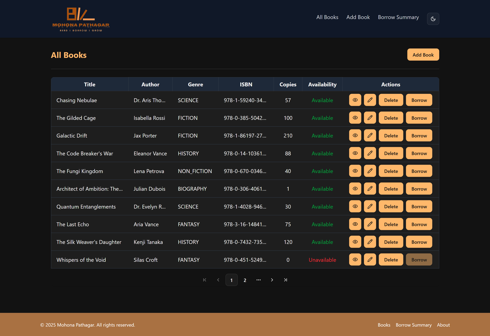
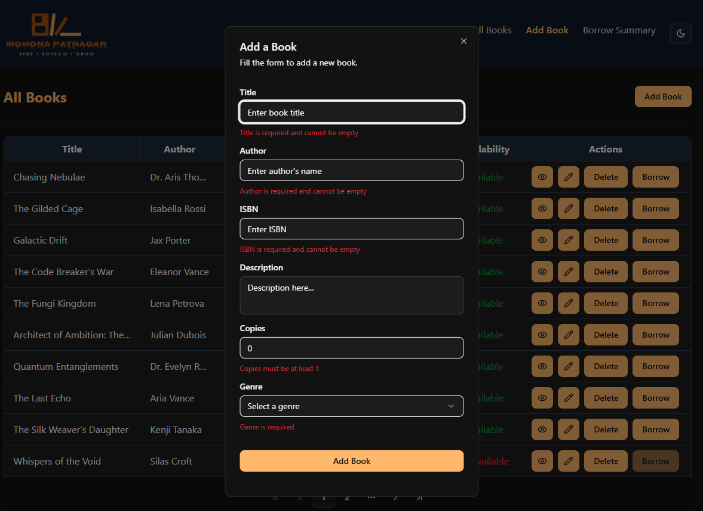
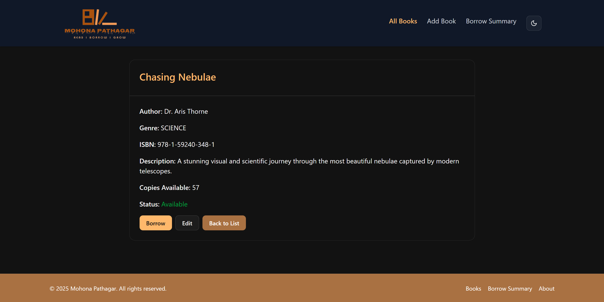
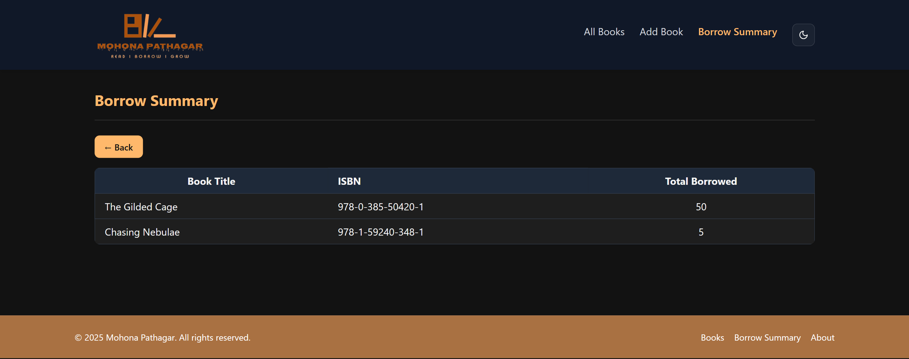

# 📚 Mohona Pathagar - Minimal Library Management System

**Slogan:** *Read - Borrow - Grow*

A feature-rich, responsive **Library Management System** built with:

* **React + TypeScript**
* **Redux Toolkit & RTK Query**
* **TailwindCSS**
* **Shadcn UI**

It provides a complete solution for managing books, borrowing, and viewing summaries with a clean and modern interface.

> ✅ **🚀 Live Demo:**
> [https://mohona-pathagar.vercel.app/](https://mohona-pathagar.vercel.app/)

---

## 📦 Project Structure

```
📦 Mohona-Pathagar (library-management-system)
├── public/
├── src/
│   ├── redux/           # Store, RTK Query APIs, UI slice
│   ├── components/      # Reusable components
│   ├── lib/             # Shadcn UI customizations
│   ├── pages/           # Route-based pages
│   ├── routes/          # App routing config
│   ├── types/           # TypeScript interfaces
│   ├── utils/           # Helpers & utilities
│   ├── App.tsx
│   └── main.tsx
│
├── tailwind.config.js
├── tsconfig.json
├── package.json
└── README.md
```

---

## 🎨 Color Scheme

### ☀️ Light Mode

| Token        | Color     | Usage                      |
| ------------ | --------- | -------------------------- |
| `primary`    | `#8B3F00` | Primary actions, headings  |
| `accent`     | `#F4A261` | Highlights, buttons, links |
| `text`       | `#5C2A00` | Main text color            |
| `secondary`  | `#BC6C25` | Borders, secondary text    |
| `background` | `#FFFFFF` | Background color           |
| `surface`    | `#FDF7F1` | Cards & surfaces           |

### 🌙 Dark Mode

| Token        | Color     | Usage            |
| ------------ | --------- | ---------------- |
| `primary`    | `#FFB86B` | Primary actions  |
| `accent`     | `#FF7E5F` | Accent, links    |
| `text`       | `#F4F4F4` | Text color       |
| `secondary`  | `#A97142` | Secondary text   |
| `background` | `#121212` | Main background  |
| `surface`    | `#1E1E1E` | Cards & surfaces |


---


## 📑 Application Pages

| Route             | Feature                        |
| ----------------- | ------------------------------ |
| `/books`          | List all books with pagination |
| `/create-book`    | Add a new book                 |
| `/books/:id`      | View book details              |
| `/edit-book/:id`  | Edit existing book             |
| `/borrow/:bookId` | Borrow a selected book         |
| `/borrow-summary` | View borrow summary            |

---

## 🛠️ Tech Stack

| Layer      | Technology               |
| ---------- | ------------------------ |
| Frontend   | React, TypeScript        |
| Styling    | Tailwind CSS, Shadcn UI  |
| State Mgmt | Redux Toolkit, RTK Query |
| Backend    | Node.js, Express.js      |
| Database   | MongoDB + Mongoose       |

---

## 🎨 UI & UX Highlights

* Minimalist and clean design
* Fully responsive across devices
* Dark mode support
* Toast notifications for user actions
* Pagination for better data handling

---


## 📸 Screenshots

### 1. All Books Page

A paginated table of books with actions to **View**, **Edit**, **Delete**, and **Borrow**.


### 2. Create Book Page

Form to add a new book with required fields.


### 3. Book Details

Full metadata of a selected book.


### 4. Borrow Summary

Summary of all borrowed books with total quantity.



## 🔗 Repositories

* **Frontend:**
  [https://github.com/Sushanto171/mohona-pathagar](https://github.com/Sushanto171/mohona-pathagar)

* **Backend:**
  [https://github.com/Sushanto171/mohona-pathagar-server](https://github.com/Sushanto171/mohona-pathagar-server)

---

## ✅ Core Features

* 📘 **Book Management (CRUD)**
* 🔍 **Book Details View**
* 🛒 **Borrow Books with Quantity & Due Date**
* 📊 **Borrow Summary with Total Borrowed**
* 📚 **Pagination on Books List**
* 🌙 **Dark & Light Mode Toggle**
* ⚡ **Optimistic UI Updates**
* 📨 **Toast Notifications for Actions**
* 📱 **Responsive Design**

---

## 🎯 My Challenge

I challenged myself to avoid **props drilling** and instead fully explore:

* 🔄 **Redux Local State + Remote API State (RTK Query)**
* 📚 **Deep Redux Ecosystem Understanding**

This helped me:

* Improve state management consistency
* Keep the UI predictable and scalable
* Avoid cumbersome prop-passing across components

---

## 🚀 Getting Started

```bash
# Clone the frontend repo
git clone https://github.com/Sushanto171/mohona-pathagar.git
cd mohona-pathagar
npm install
npm run dev

# Clone the backend repo
git clone https://github.com/Sushanto171/mohona-pathagar-server.git
cd mohona-pathagar-server
npm install
npm run dev
```

---

## 🙌 Acknowledgments

* **Redux Toolkit & RTK Query**
* **Shadcn UI**
* **Tailwind CSS**

---

> **Developed with ❤️ by Sushanto Kumar**
> *Read, Borrow, Grow*

---


